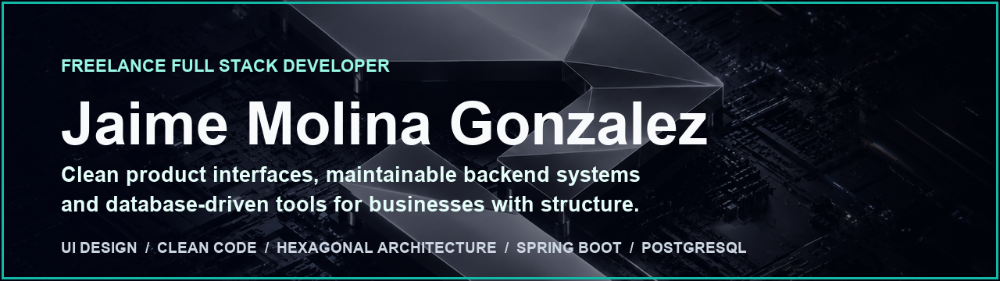

<p align="center">
  
</p>

<div align="center">

`UI DESIGN` / `CLEAN CODE` / `HEXAGONAL ARCHITECTURE` / `SPRING BOOT` / `POSTGRESQL`

</div>

---

## What I bring

**Product thinking with engineering discipline.**

<table>
  <tr>
    <td width="33%" valign="top">
      <h3>Interfaces</h3>
      <p>Clean dashboards, admin panels and product UI that make complex data easier to use.</p>
    </td>
    <td width="33%" valign="top">
      <h3>Systems</h3>
      <p>Backend APIs, business rules and database structure designed with clear boundaries.</p>
    </td>
    <td width="33%" valign="top">
      <h3>Foundations</h3>
      <p>Clean Code, Hexagonal Architecture, Docker-ready environments and pragmatic decisions per project.</p>
    </td>
  </tr>
</table>

---

## About Me

> **Developer profile**

I’m a **Freelance Full Stack Developer** who builds complete products: clean interfaces, backend logic, database structure and architectural boundaries that make the project easier to evolve over time.

| # | Principle | How I apply it |
|---|---|---|
| 01 | **Architecture with purpose** | I like Hexagonal Architecture, but only when it helps protect the domain and reduce coupling. |
| 02 | **Clean code over clever code** | Readable naming, small responsibilities and simple flows beat over-engineered abstractions. |
| 03 | **Adapt to the project** | Every product has different constraints, so the solution should fit the context — not the other way around. |

---

## Tech Stack

| Area | Focus | Tools |
|---|---|---|
| **Frontend** | Interfaces and product UI. I use React and TypeScript when the project needs structure, scalability and safer iteration. |  |
| **Backend** | Business logic and APIs. Java and Spring Boot for systems where maintainability, clear boundaries and stability matter. |  |
| **Data & DevOps** | Data, environments and delivery. PostgreSQL, SQL and Docker to build database-driven products with reproducible setups. |  |

---

## System Levels

```txt
01  Interface layer
    Clean UI, dashboards and admin panels that make complex workflows easier to understand and operate.

02  Application layer
    Backend APIs, use cases and business rules with clear responsibilities and maintainable boundaries.

03  Infrastructure layer
    PostgreSQL, Docker-ready environments, Git workflow and project decisions adapted to real constraints.
```

---

<p align="center">
  <strong>Clean software. Pragmatic architecture. Product-first execution.</strong>
</p>
